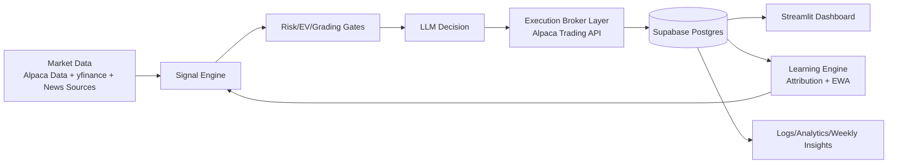
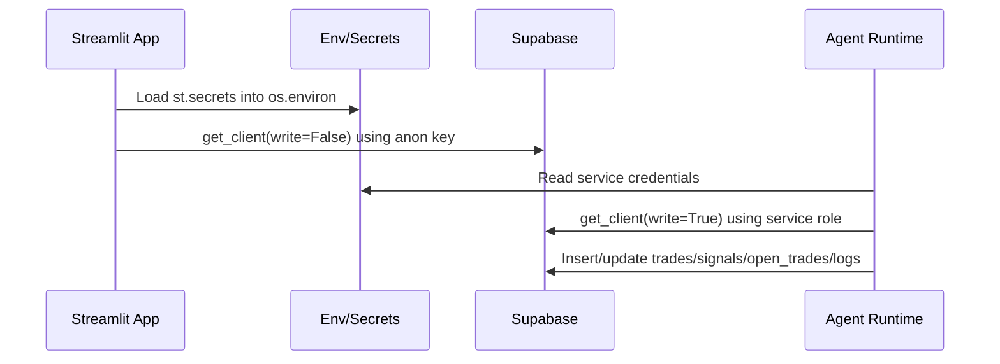
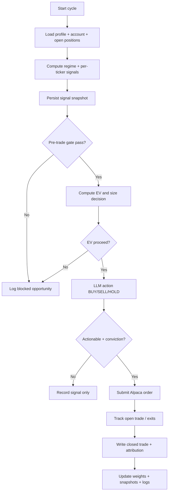

# TradeSigns Business + Technical Architecture Deck (PowerPoint-Compatible Markdown)

## Slide 1 — Title
**TradeSigns: AI-Assisted Paper Trading Platform**  
Business + Technical Architecture Review  
Date: 2026-05-12

**Speaker notes**
- This deck summarizes what the platform does, how it works technically, and where to focus next for scale and institutional readiness.

---

## Slide 2 — Executive Summary
- TradeSigns is an automated paper-trading system for US equities/ETFs with a live analytics dashboard.
- The platform computes multi-signal trade setups, gates them through risk + expected value checks, then places/monitors Alpaca paper orders.
- Supabase acts as system-of-record for signals, trades, learning state, logs, and dashboard views.
- A Streamlit multi-page frontend exposes operations, performance, grading quality, and portfolio review workflows.
- Core strengths: disciplined guardrails, iterative learning engine, transparent observability.
- Core constraints: single-process scheduler design, external API dependency risk, and limited auth beyond secret-key model.

**Speaker notes**
- Emphasize that the current stack is optimized for speed of iteration and low operating cost.

---

## Slide 3 — What the Business Does
- Provides AI-supported *paper trading automation* rather than retail broker execution-as-a-service.
- Primary value: convert noisy market data into structured, risk-adjusted trade decisions and measurable learning loops.
- Secondary value: decision explainability via saved signal metadata, LLM rationale, and post-trade analytics.
- Monetization path (future): strategy subscriptions, advisor tooling, research/insights API, managed signal feeds.

**Speaker notes**
- Position current state as “productized research + execution simulator” with strong pathway to pro tooling.

---

## Slide 4 — User Personas & Workflows
**Personas**
- **Quant tinkerer / founder**: tunes profiles, signal mix, and scheduling.
- **Operator / PM**: monitors live signals, logs, and blocked opportunities.
- **Investor / stakeholder**: reviews performance, risk posture, and weekly learning narratives.

**Workflows**
1. Configure risk profile + ticker universe via env/secrets.
2. Agent runs signal cycle during market windows.
3. Trades logged and learning engine updates adaptive weights.
4. Dashboard users inspect overview, trades, learning, grading, yield/sweep, logs.

**Speaker notes**
- The core user behavior is monitoring and tuning, not manual order entry.

---

## Slide 5 — Core Product Features
- Multi-page dashboard: overview, live signals, trades, performance, grading, learning, yield/sweep, portfolio review, config, logs.
- Multi-signal scoring engine with caching and fallback data-source logic.
- Risk profile framework (conservative → aggressive) with profile-specific constraints and weights.
- Execution path with pre-trade gate, EV gate, LLM decision, bracket orders, and structured persistence.
- Continuous learning via attribution + EWA weight updates, with regime-aware blending.
- Operational modules: dividends scanner, sweep planning, grading/quality layers.

**Speaker notes**
- Mention that some capabilities have evolved beyond the original 5-signal concept into expanded signal columns.

---

## Slide 6 — System Architecture (Logical)

**Speaker notes**
- Explain closed-loop structure: inference → action → telemetry → learning → updated inference.

---

## Slide 7 — Backend Services & Responsibilities
- `backend/agent.py`: orchestration, scheduling windows, cycle state, swing/intraday pathways, replay checks.
- `backend/signals/engine.py`: regime state model, market data access, per-signal scoring, cache TTLs.
- `backend/broker/alpaca.py`: account/position/order abstractions, paper/live safety checks, bracket handling.
- `backend/learning/engine.py`: attribution, expected value calculations, EWA/regime-aware weight engines.
- `backend/grading/engine.py`: setup grading and quality thresholds influencing execution decisions.
- `backend/sweep`, `backend/dividends`, `backend/portfolio`: capital optimization and review helpers.

**Speaker notes**
- Architecture is modular by concern, but deployment is still a single Python runtime.

---

## Slide 8 — Frontend Architecture
- Entry-point `app.py` sets Streamlit config, loads secrets into env, and lazy-loads page modules.
- Navigation is module-driven (`frontend/pages/*.py`) with domain-specific page responsibilities.
- Dashboard reads from database client abstraction rather than direct SQL in UI layers.
- Current auth model is deployment-secret based (Streamlit environment), not user-level identity.

**Speaker notes**
- Highlight low-friction UX and rapid iteration benefits of Streamlit multipage architecture.

---

## Slide 9 — Database Schema & Important Entities
- Supabase/Postgres schema centered on `trades`, `open_trades`, `signals`, `signal_weights`, `news_cache`.
- Identity PK strategy uses `bigint generated always as identity` for primary tables.
- Key analytics support via indexes on time, ticker, status, and performance metrics.
- JSONB columns capture extensible metadata (`signals_json`, `sizing_json`, `regime_debug_json`).
- Migrations folder shows iterative feature expansion: diagnostics, replay, execution sizing, yield curve, etc.

**Speaker notes**
- Stress schema maturity and backward-compatible migration style as operational advantage.

---

## Slide 10 — APIs & Integrations
- **Broker + market data**: Alpaca Trading/Data clients.
- **Fallback/alt market data**: yfinance.
- **News ingestion**: NewsAPI and web parsing helpers.
- **LLM inference**: Groq client configured via `GROQ_API_KEY` in learning engine.
- **Data platform**: Supabase Python client with read/write key split.
- **Notifications/ops**: Discord notifier script and scheduler workflows.

**Speaker notes**
- External dependency management is a major reliability and cost lever.

---

## Slide 11 — Authentication & Authorization Flow

- Read/write separation is explicit in database client API.
- RLS-friendly read path and privileged write path are intentionally separated.
- No per-end-user auth currently implemented in frontend.

**Speaker notes**
- Today this is service-auth architecture, not multi-tenant product auth.

---

## Slide 12 — Trading/Signals Logic & Business Rules
- Signal computation aggregates multiple micro-signals into normalized composite scores.
- Trades are gated by hard pre-trade risk checks, then EV net-of-cost checks.
- EV pathway supports full, reduced, or probe sizing based on learned sample quality.
- LLM decisioning is called after statistical/risk gates and includes conviction handling.
- Risk profiles constrain notional, drawdown, hold times, shorting, and instrument universe.
- Regime-aware learning updates weights using attribution and EWA decay.

**Speaker notes**
- Important business principle: model discretion is bounded by deterministic controls.

---

## Slide 13 — Event/Data Flow Diagram (Cycle)

**Speaker notes**
- This diagram maps directly to backend orchestrator responsibilities.

---

## Slide 14 — Deployment & Infrastructure Overview
- Runtime orchestration is designed for scheduled execution (GitHub Actions in project docs) plus Streamlit-hosted UI.
- Supabase hosts Postgres storage, views, and access policy surface.
- Python services execute as process-local modules (not microservices), reducing ops complexity.
- Observability is DB-native: `agent_logs`, trade diagnostics, replay metadata, and performance pages.

**Speaker notes**
- Current infra is appropriate for pre-scale phase; horizontal isolation is a next-stage concern.

---

## Slide 15 — Key Dependencies & Third-Party Services
- Core Python libs: `streamlit`, `supabase`, `alpaca-py`, `yfinance`, `pandas`, `numpy`, `plotly`.
- AI inference integration currently references Groq client in learning pipeline.
- Supporting libs include dotenv, requests, BeautifulSoup, and scheduling/analytics stack components.
- Third-party service concentration risk: Alpaca + Supabase + LLM provider + market/news feeds.

**Speaker notes**
- Dependency governance (pinning, retries, fallback behavior) should be formalized further.

---

## Slide 16 — Risks, Scalability, Technical Debt
**Risks**
- External API volatility and quota limits can degrade signal reliability.
- Service-role key use in runtime broadens blast radius if leaked.
- Single-process orchestration limits scaling and fault isolation.

**Scalability considerations**
- Move to queue-based job fan-out per ticker/regime.
- Introduce idempotency keys and stronger order-state reconciliation.
- Add dedicated metrics/alerting pipeline (e.g., Prometheus + alerting).

**Technical debt**
- Config sprawl through env vars.
- Mixed historic docs vs current implementation naming (e.g., Claude vs Groq keys).
- Evolving schema complexity with many optional JSONB fields.

**Speaker notes**
- Emphasize that most debt is manageable and normal for a high-iteration prototype.

---

## Slide 17 — Recommendations (Next 2 Quarters)
1. **Security hardening**: rotate keys, scope secrets per environment, add UI auth.
2. **Reliability**: circuit breakers/retries for each integration and dead-letter flow for failed cycles.
3. **Scalability**: split orchestration from execution worker(s), introduce task queue.
4. **Data quality**: schema contracts for JSONB payloads and migration test harness.
5. **Model governance**: decision audit tables, drift dashboards, and shadow-mode experiments.
6. **Business readiness**: KPI taxonomy (alpha, drawdown, Sharpe proxy, hit-rate by regime) and investor reporting cadence.

**Speaker notes**
- Tie recommendations directly to productionization and fundraising credibility.

---

## Slide 18 — Detailed Slide-by-Slide Outline
1. Title
2. Executive summary
3. Business model and value proposition
4. Personas and workflows
5. Product features
6. Logical architecture
7. Backend component map
8. Frontend component map
9. Data model/schema
10. Integrations and external APIs
11. AuthN/AuthZ flow
12. Trading rules + learning loop
13. End-to-end cycle flow
14. Infrastructure/deployment
15. Dependencies
16. Risks and technical debt
17. Roadmap recommendations
18. Appendix / Q&A

**Speaker notes**
- This sequence is optimized for mixed business + technical audiences.

---

## Slide 19 — Appendix: Component Inventory
- Backend domains: `agent`, `signals`, `broker`, `learning`, `grading`, `portfolio`, `sweep`, `dividends`, `earnings`, `metrics`.
- Frontend pages: overview/signals/trades/performance/grading/learning/yield/portfolio review/config/logs.
- Database assets: base schema + migration history with replay, diagnostics, and portfolio review extensions.

**Speaker notes**
- Useful backup slide for architecture review Q&A.

